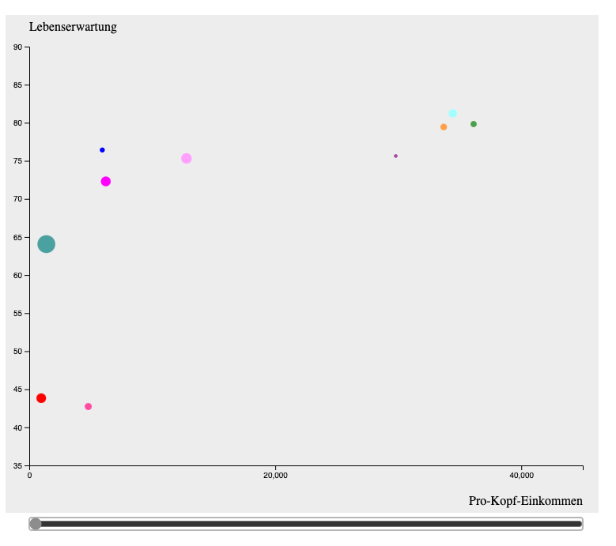
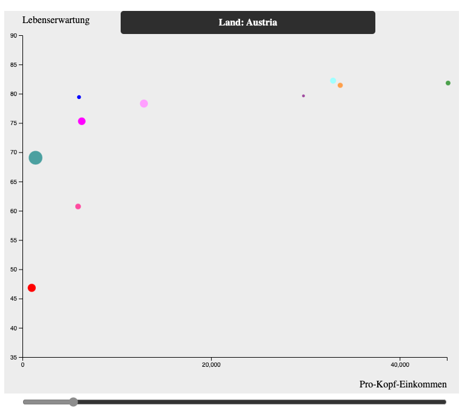

## D3.js - Bubblechart

### Wilhelm Büchner Hochschule - Nano Degree: Gestaltung interaktiver Systeme - Aufgabe zur Informationsvisualisierung

Darstellung von Lebenserwartung, Einkommen pro Kopf, Einwohnerzahl für 10 verschiedene Länder und für 10 verschiedene Jahre.

  &nbsp; 
  &nbsp;
  &nbsp;

